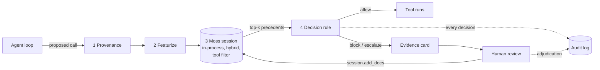

# Architecture

## Request path (one action)

| Step | What happens | Where |
|---|---|---|
| 1 | The harness traces each argument value to the content it appeared in (untrusted email body vs. internal tool output). Values corroborated by a trusted source stay trusted. | `provenance.py`, `demo/env.py` |
| 2 | The action becomes a short canonical text plus an exact signature (tool, argument names incl. absent-but-expected, provenance class, harness check results). | `featurize.py` |
| 3 | One hybrid query (`alpha=0.5`, `top_k=8`) to the local Moss session, filtered to the same tool. | `index.py` |
| 4 | Weighted vote of the top five. Same-signature neighbours count fully, other-signature neighbours at 0.15, human precedents ×1.5. Block at `p_block ≥ 0.35`; allow at `p_block ≤ 0.15` with support; otherwise escalate. No same-tool or same-signature precedent escalates directly. | `decide.py` |
| 5 | An evidence card is built (top precedents with weights, matched and differing features, sha256) and streamed to the UI and the audit log. | `evidence.py`, `api.py` |

## Latency budget

Hard budget per check: **50 ms** (`PRECEDENT_BUDGET_MS`). Exceeding it, or any retrieval/decision error, returns **block** with reason `fail_closed_*`. Measured components: featurize and decision are about 0.05 ms combined; the Moss query dominates (4.3 ms back-to-back, 15 ms when calls are spaced 300 ms apart on the dev laptop).

## Write-back

`POST /v1/adjudicate` builds the same canonical text for the reviewed action, inserts it with `session.add_docs`, then runs a probe query to confirm the new precedent is actually returned. The reported insert-to-retrievable time includes that probe. Decisions are also appended to `data/adjudications.jsonl` and replayed on boot.

## Trust boundaries

Untrusted: email bodies, third-party tool output. Trusted: internal system output, verified headers, ticket ids from the inbox listing. The agent's own stated intent is used only as free-text context for retrieval, never as evidence of provenance.

## Findings about Moss that shaped the design

These were measured, not assumed; they are the reason the rule looks the way it does.

1. **Scores are compressed and noisy.** Block vs. allow neighbours differed by ~0.03; an unrelated tool still scored 0.94–0.98; the same query returned the same document at 1.00, 0.97 and 0.96 across calls. Hence: no score thresholds, kernel weights over score *gaps*, exact-signature gating, and a stability test across repeated retrievals.
2. **Metadata is folded into scoring.** An identical document scored 0.956 with a note in its metadata and 1.000 without. Hence: only `tool` and `verdict` go to Moss; everything else lives in a local registry keyed by document id.
3. **Session inserts are immediately queryable** (verified), which is what makes same-session enforcement possible.
4. **Latency is bimodal.** ~4–5 ms back-to-back, ~15 ms with 300 ms gaps on the dev laptop; a keep-warm loop did not change it. Both are reported; re-measure on the host.

## Data

`data/seed_actions.jsonl` (403 synthetic precedents, ~70/30 allow/block, includes the three labelled injection blocks), `calibration.jsonl` (62, used only to choose thresholds), `heldout*.jsonl` (103 each; v1 and v2 were used to diagnose errors and are no longer clean, v3 was scored once). All synthetic; see DISCLOSURES.
